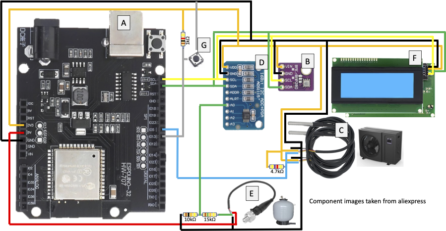
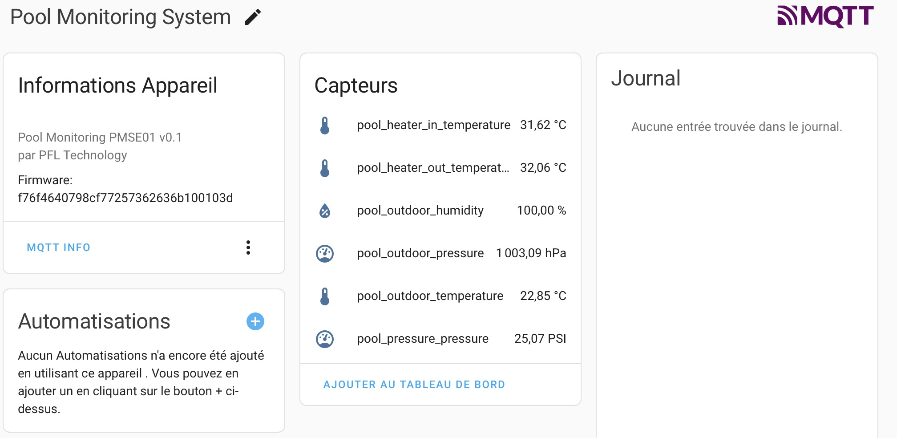

# Pool monitoring system

THis "pool monitoring system" is designed to analyse and follow up the status of your pool environment.
Using your phone cell, you can easily check and control temperature, water pressure and humidity.

## Architecture

THe architecture is designed around:
- the microcontroler ESP32, as hardware
- an integrated AP in ESP32, as web server
- Home assitance with MQTT broker to pool frequently information to the phone cell

THe programming language is written in C++ in PlatformIO
These choises are based on recent and efficient desgin.

The device can be configured by a web interface (first launch / WiFi connexion error / long press).

. As, exempla, it can show :

- in / out temperature of the heat pump
- external temperature, pressure and humidity
- water pressure

The device can be configured using a a brower on any computer, phone cell or tablet (first launch / WiFi connexion error / long press). An AP is created on the ESP32. This version is not protected versus hacking.

The system is given has is. The code is open source and can be used for personal use.

## Hardware

This project requires an ESP32 as a microcontroller and some peripherals:

- 1 BME280 sensor (I2C) for external temperature, pressure and humidity
- 2 DS18B20 sensors (1 wire) for water in and out temperatures
- 1 ADS1115 ADC (I2C) for  the analog water pressure sensor
- 1 analog water pressure sensor 0-30 PSI (0-4,5V) for the sand filter
- 1 I2C LCD 20x4 to display current information
- 1 push button to activate the LCD backlight (simple press) or launch configuration mode (long press)



## Serial commands

The list of available commands can be obtained by sending the command ```help```.

```
> help
Available commands:
 Configuration:
  infos               | Print configuration infos
  get <key>           | Get the value of a configuration key
  set <key> <value>   | Set configuration value (needs reboot)
  save                | Save configuration
  reboot              | Reboot the device

 Tools:
  scan <deviceType>   | Available device types : i2c, ds18b20
  id                  | Print the device ID

  help
```

Here is some examples of commands:

```
> id
ID: 66666666

> infos
Configuration infos :
---------------------
  poolHeaterInAddress: 28:6a:76:4c:38:43:13:23
  poolHeaterOutAddress: 28:65:16:4b:ab:42:13:43
  mqttServerIP: 192.168.23.123
  mqttServerPort: 1883
  mqttUser: mqttuser
  mqttPassword: Passw0rd
  mqttTopicPrefix: piscine
  debug: 4
---------------------
```

## Networking

### Trying to improve signal quality (Failed !)

After testing the signal quality, I found that the signal is not good enough. I've tried to add an external antenna, but it didn't work.

As described on some web pages, one can add an external antenna to your ESP32. To do it, one can cut the existing antenna on the ESP32 module and solder wires on it. Here is some links ([Link #1](https://community.home-assistant.io/t/how-to-add-an-external-antenna-to-an-esp-board/131601), [Link #2](https://www.hackster.io/simon-vavpotic/esp32-and-esp8266-external-antenna-f28e6b))


To make my hack more conveniant, I've put an UFL seat IPEX / IPX connector.


My tests shown similars signal quality with unmodified ESP32 dev board and the modified one. In my case, the problem could be the antenna quality. So, for me, that's a waste of time, but could be an interesting idea to try.

### Connecting to the network

My network contains multiple APs. When trying to connect to a given SSID, the ESP32 will try to connect to the first AP that matches the SSID. But this AP is not always the best one. So I've add a scan of available APs with the SSID to find the one with the best RSSI (signal quality). This method works for me and is the one propose on the source code.

## Home assistant

When the device is setup, it can be used in Home Assistant. It will send autodiscovery messages to the MQTT broker. It can be easily integrated in Home Assistant.


